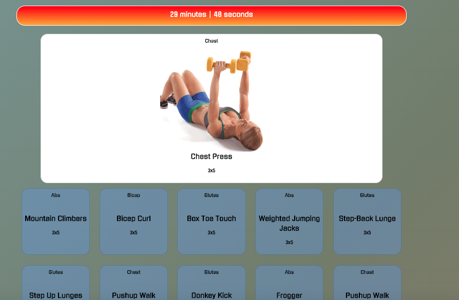

# Beast Mode (Project 2)

https://point-of-s.herokuapp.com/

<strong>Beast Mode Home</strong>
<br>


<strong>New Workout</strong>
<br>


# Description

WHEN I want to workout / keep fit...
GIVEN I input a length of workout time and muscle groups to target...
THEN I receive a dynamically generated workout routine with videos to guide me per my desired length of time

# Technologies Used

- Handlebars
- Node.js
- Bootstrap, jquery, anime.js, Google Fonts
- Express
- Sequelize + mySQL
- Heroku
- Travis-CI
- Airtable

# Overview

- Beast Mode generates a user a workout routine based on:

  - Desired duration of workout
  - Desired muscles to workout

- After a workout routine has been dynamically generated, the user receives helpful animated gifs to guide him / her along.

- The application highlights the current exercise to be performed while showing the rest of the exercises to come.

# Installation

Run the following command to install:

```
npm install
```

# Start

Run the following command to install:

```
node server.js
```

# Watch

Run the following command to install:

```
nodemon server.js
```
